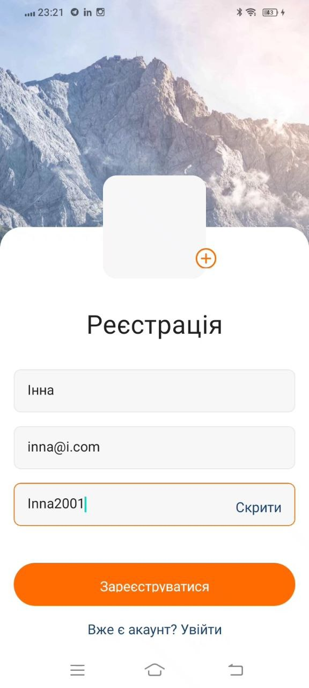
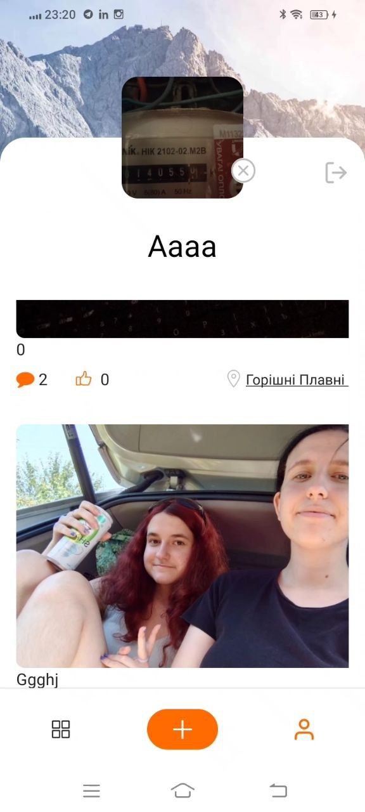

# MobileApp

This project was bootstrapped with [Create React App](https://github.com/facebook/create-react-app). To get acquainted and configure additional features refer to documentation.

# Technologies

React Native
Redux
FireBase
Expo Go
React Router
Redux Persist
Styled Components

### Description of application

A Quiz app that combines learning, play, and self-expression. Designed for any age and level of knowledge. The application allows both registered and non-registered users to choose and take quizzes.

It has three pages, for viewing the added photos of all users, for creating your posts and for viewing your profile.

Initial registration page.

All publications page.

Your profile page.

You can leave comments.

Adding a photo with the option to leave a description and its geolocation.

## Learn More

You can learn more in the [Create React App documentation](https://facebook.github.io/create-react-app/docs/getting-started).
